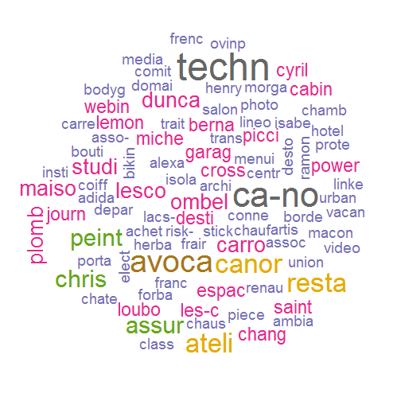

The best french domain name
========================================================
author: Javier Saenz
date: 26.03.2016

The problem to solve
========================================================

There are more than 280 million domain names registered.   
Finding good available domains is getting more complicated, data.com already registered ;)

If you want to recommend domains to users on a different language than yours, you have to make use of Data ;)

One option is to add common prefixes or suffixes to the wishdomain.  
Example:
If a french Data Scientist wants to register a domain related with "data", we could suggest him:
- francedata.com
- atelier-data.com


Where do we find French prefixes and suffixes?
========================================================

Afnic is the provider of .fr, and offers public access to a list of more than 3 million .fr domains   

1. We download the data from http://open.afnic.fr 
2. Select the first/last n letters of those domains.
3. Using the text mining package *tm* we create a Term Document Matrix
4. We plot a Word Cloud


Which are the most common prefixes and suffixes on domain names?
========================================================


```

Read 45.8% of 523845 rows
Read 74.4% of 523845 rows
Read 523845 rows and 4 (of 4) columns from 0.020 GB file in 00:00:05
```



Come and play
========================================================

- Shiny App: https://javiersaenz.shinyapps.io/FR_AffixApp
- Code in GitHub: https://github.com/dernapo/FR_AffixApp
